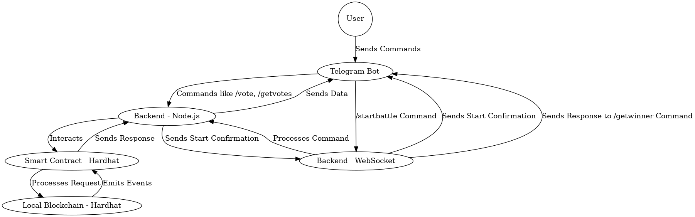

# SonorousBattle

SonorousBattle is a Telegram bot integrated with blockchain functionality. This bot allows users to engage in music battles, vote on battles, and manage blockchain-based transactions related to the battles. It offers an interactive and secure way to handle music competitions and related financial transactions.

---

## Table of Contents
- [Commands](#commands)
- [Features](#features)
- [Diagram](#diagram)
- [Installation](#installation)
- [Contact Info](#contact-info)

---

## Commands

### Telegram Bot Commands:

- `/start` - Start the bot.
- `/help` - List all available commands.
- `/startbattle` - Start a new music battle.
- `/battlevotes <battleId>` - Retrieve the current votes for a specific battle.
- `/battledetails <battleId>` - Get detailed information about a specific battle.
- `/battlevoters <battleId>` - Get the total number of voters for a battle.
- `/leaderboard <battleId>` - Display the top voters in a battle.
- `/getVotersList <battleId>` - Fetch the list of all voters in a battle.
- `/getContractBalance` - Retrieve the balance held by the blockchain contract.
- `/closeBattle <battleId>` - Close a specific battle identified by battleId.
- `/transferToOwner <amount> <userAddress> <senderAddress>` - Transfer funds from the contract to the sender’s address (owner only).

---

## Features

- Interactive Telegram bot interface for music battles.
- Integration with Spotify API to fetch and display tracks for battles.
- Blockchain functionality to manage transactions and battle data securely.
- Voting system for users to choose their favorite tracks.
- Leaderboard to showcase top voters.
- Smart contract-based fund management.

---

## Diagram



## Installation

### Prerequisites:
- Node.js
- Python
- Hardhat

## Installation and Setup Guide

Follow these steps to set up and run the project:

### 1. Install Node.js Dependencies
Run this command in the root of your project directory:
```bash
npm install
```
### 2. Start the Hardhat Node
Initialize the blockchain environment:
```bash
npx hardhat node
```
### 3. Deploy Smart Contracts
Open a new terminal and deploy the smart contracts to the local Hardhat network:
```bash
npx hardhat run scripts/deploy.js --network localhost
```
### 4. Start the Backend Server
Navigate to the backend directory and start the server:
```bash
cd backend
node app.js
```
### 5. Set Up the Python Bot
Navigate to the bot directory and follow these steps:

- a. Create a Python Virtual Environment
```bash
cd bot
python -m venv env
```
- b. Activate the Virtual Environment
For Windows:
```bash
.\env\Scripts\activate
```
- c. Install Required Python Dependencies
Install the necessary Python packages:
```bash
pip install requests python-telegram-bot spotipy websockets google-api-python-client
```
- d. Start the Telegram Bot
Run the bot using:
```bash
python bot.py
```