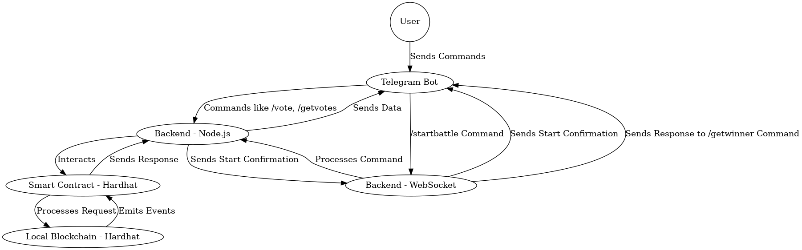
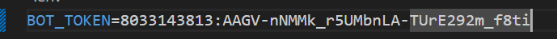
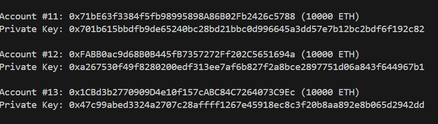
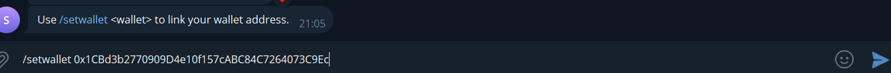
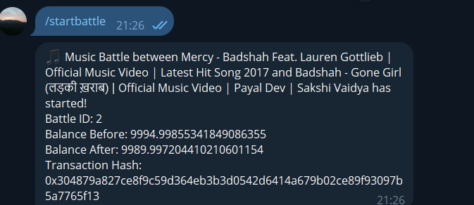
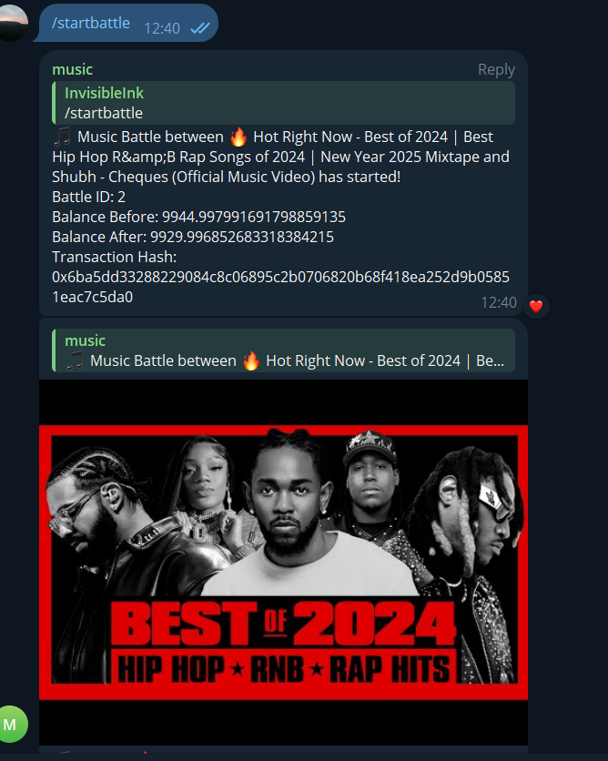
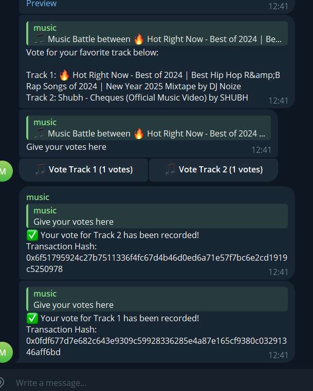
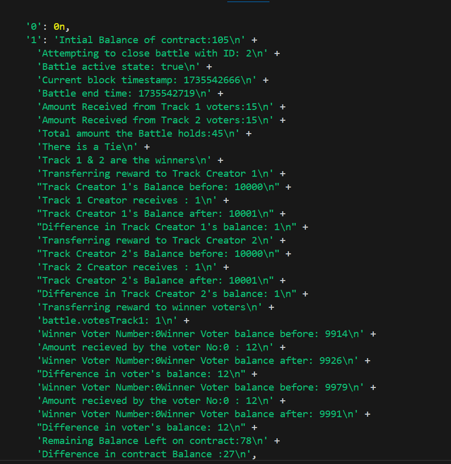
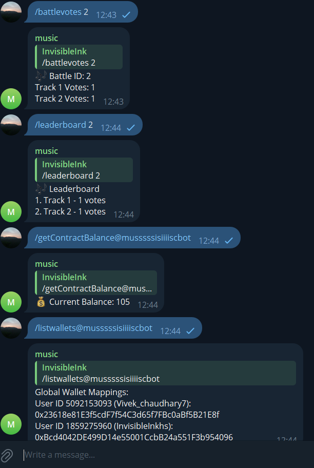

# SonorousBattle

SonorousBattle is a Telegram bot integrated with blockchain functionality. This bot allows users to engage in music battles, vote on battles, and manage blockchain-based transactions related to the battles. It offers an interactive and secure way to handle music competitions and related financial transactions.

---

## Table of Contents
- [Commands](#commands)
- [Features](#features)
- [Diagram](#diagram)
- [Installation](#installation)
- [Getting Started](#getting-started)
- [Usage](#usage)
- [Contact Info](#contact-info)

---

## Commands

### Telegram Bot Commands:

- `/start` - Start the bot.
- `/help` - List all available commands.
- `/startbattle` - Start a new music battle.
- `/battlevotes <battleId>` - Retrieve the current votes for a specific battle.
- `/battledetails <battleId>` - Get detailed information about a specific battle.
- `/battlevoters <battleId>` - Get the total number of voters for a battle.
- `/leaderboard <battleId>` - Display the top voters in a battle.
- `/getVotersList <battleId>` - Fetch the list of all voters in a battle.
- `/getContractBalance` - Retrieve the balance held by the blockchain contract.
- `/closeBattle <battleId>` - Close a specific battle identified by battleId.
- `/transferToOwner <amount> <userAddress> <senderAddress>` - Transfer funds from the contract to the sender’s address (owner only).
- `/setwallet <wallet_address>` - Set your wallet address for the first time. If you've already set one, it will return your current wallet.
- `/changewallet <new_wallet_address>` - Change your existing wallet address.
- `/getwallet` - Get your current wallet address. If you haven't set one, it will inform you.
- `/listwallets` - List all wallet addresses set by users in this group.
---

## Features

- Interactive Telegram bot interface for music battles.
- Integration with Youtube API to fetch and display tracks for battles.
- Blockchain functionality to manage transactions and battle data securely.
- Voting system for users to choose their favorite tracks.
- Leaderboard to showcase top voters.
- Smart contract-based fund management.

---

## Diagram



---

## Installation

### Prerequisites:
- Node.js
- Python
- Hardhat

### Installation and Setup Guide

Follow these steps to set up and run the project:

1. **Clone the Project**
   ```bash
   git clone https://github.com/himanshu-sugha/SonorousBattle.git
   ```

2. **Install Node.js Dependencies**
   Run this command in the root of your project directory:
   ```bash
   cd SonorousBattle
   npm install
   ```

3. **Create `.env` Files**
   - **Bot Folder's `.env` File**:
     ```env
     BOT_TOKEN=paste your bot token you got from BotFather
     ```
     ---
     ---
     

   - **Backend Folder's `.env` File**:
      You will get contract address is step 5 of installation . if you are still facing problem see the step 1 of usage from where to copy the contact address
     ```env
     # Replace with the deployed contract address. you will get that when you will do step 5 of installation

     CONTRACT_ADDRESS=0x5FbDB2315678afecb367f032d93F642f64180aa3

     # Use with caution; consider using a more secure method in a production environment
     PRIVATE_KEY=0xac0974bec39a17e36ba4a6b4d238ff944bacb478cbed5efcae784d7bf4f2ff80

     # Address of account 0
     ACCOUNT_ADDRESS=0xf39Fd6e51aad88F6F4ce6aB8827279cffFb92266
     ```
     
4. **Start the Hardhat Node**
   Initialize the blockchain environment:
   ```bash
   cd SonorousBattle
   npx hardhat node
   ```

5. **Deploy Smart Contracts**
   Here you will get deployed contract address .donot forget to update in env file you created
   Open a new terminal and deploy the smart contracts to the local Hardhat network:
   ```bash
   cd SonorousBattle
   npx hardhat run scripts/deploy.js --network localhost
   ```

6. **Start the Backend Server**
   Navigate to the backend directory and start the server:
   ```bash
   cd SonorousBattle
   cd backend
   node app.js
   ```

7. **Set Up the Python Bot**
   Open a new terminal and navigate to the `bot` directory, then follow these steps:

   - **a. Create a Python Virtual Environment**
     ```bash
     cd SonorousBattle
     python -m venv env
     ```

   - **b. Activate the Virtual Environment**
     For Windows:
     ```bash
     .\env\Scripts\activate
     ```

   - **c. Install Required Python Dependencies**
     Install the necessary Python packages:
     ```bash
     pip install requests python-telegram-bot spotipy websockets google-api-python-client python-dotenv
     ```

   - **d. Start the Telegram Bot**
     Run the bot using:
     ```bash
     python bot.py
     ```

---

## Getting Started

### Steps to Use the Bot:

1. **Start the Bot**
   Use the `/start` command to start the bot.

2. **Set Your Wallet Address**
   Set your wallet address using one of the addresses provided by Hardhat:
   

   Example of setting the wallet address:
   

3. **Start a Battle**
   Use the `/startbattle` command to initiate a battle. Note down the battle ID.

   - **Note:** The current battle timer is low, so vote quickly. If the summary appears before you vote, start a new battle.
   
   

4. **Vote**
   Choose your genre and vote during the battle.

5. **Explore Commands**
   Use the `/help` command to view all available commands. Some commands require the `battleId`.

---

## Usage

### 1. Start Battle

- **Contract Deployment:**
  Before starting a battle, deploy the smart contract. Once deployed, copy the contract address and paste it into your `.env` file.

  

- **Start Battle UI:**
  This is how the "Start Battle" interface looks in the bot:

  
---
---
### 2. Voting

- **Voting UI:**
  Users can vote for their favorite tracks during a battle. Below is the "Voting" interface in the bot:

  

---
---
### 3. Terminal Usage

- **Info Screenshot:**
  Here's a screenshot showing how the terminal output looks when running the bot and interacting with the contract:

  

---
---
   
### 4. Bot Features

- **Features List:**
  Some of the key features of the bot include the ability to start battles, vote, and retrieve battle details. Ensure to include the `battleId` when using specific commands.

  

---

## Contact Info

For any issues or questions, contact: **himanshusugha@gmail.com**
